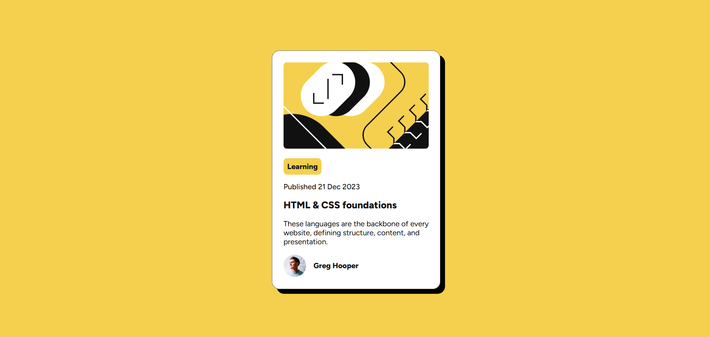

# Frontend Mentor - Blog preview card solution

This is a solution to the [Blog preview card challenge on Frontend Mentor](https://www.frontendmentor.io/challenges/blog-preview-card-ckPaj01IcS).

## Table of contents

- [Overview](#overview)
  - [Screenshot](#screenshot)
  - [Links](#links)
- [My process](#my-process)
  - [Built with](#built-with)
- [Author](#author)

## Overview

### Screenshot

### Links

- Solution URL: [GitHub](https://github.com/AlejandroIMP/blog-card-component)
- Live Site URL: [Blog](https://blog-card-component-frontend.netlify.app/)

## My process

### Built with

- Semantic HTML5 markup
- CSS custom properties
- Flexbox

### What I learned

I learned about semantic HTML and CSS with flexbox and shadows

## Author

- Frontend Mentor - [@AlejandroIMP](https://www.frontendmentor.io/profile/AlejandroIMP)
- Twitter - [@AlejandroRTW](https://x.com/AlejandroRtw)
